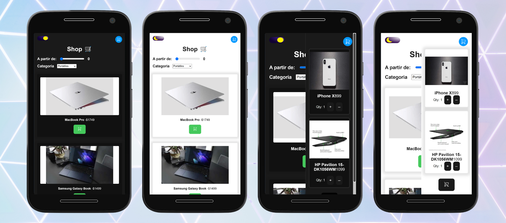
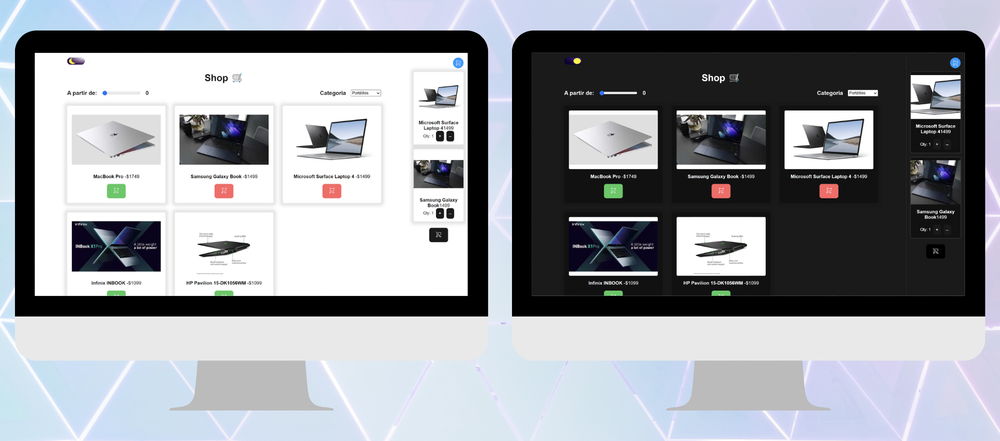

# 🛒 App Shop

Este proyecto es una aplicación de comercio electrónico construida utilizando React, Next.js y Typescript. La aplicación cuenta con una serie de componentes, contextos y hooks diseñados para gestionar el carrito de compras, filtrar productos y cambiar el tema de la aplicación.

<br/>

# 🧩Componentes

<<<<<<< Updated upstream
- `Cart`: muestra y gestiona el carrito de compras del usuario
- `Filters`: permite al usuario filtrar los productos por categoría y precio mínimo
- `Header`: componente de encabezado que incluye el logotipo, el ícono del carrito y el botón de cambio de tema
- `Icons`: contiene los íconos utilizados en la aplicación
- `ProductList`: muestra la lista de productos disponibles
- `Toggle`: componente para cambiar el tema de la aplicación
=======
`Cart`: muestra y gestiona el carrito de compras del usuario
`Filters`: permite al usuario filtrar los productos por categoría y precio mínimo
`Header`: componente de encabezado que incluye el logotipo, el ícono del carrito y el botón de cambio de tema
`Icons`: contiene los íconos utilizados en la aplicación
`ProductList`: muestra la lista de productos disponibles
`Toggle`: componente para cambiar el tema de la aplicación
>>>>>>> Stashed changes

<br/>

# 🌐 Contextos

- `cartContext`
<<<<<<< Updated upstream
Este contexto proporciona un estado global para el carrito de compras del usuario. Los componentes pueden utilizar este contexto para agregar o eliminar productos del carrito.

- `filtersContext`
Este contexto proporciona un estado global para los filtros de productos. Los componentes pueden utilizar este contexto para aplicar o eliminar filtros.

- `themeContext`
Este contexto proporciona un estado global para el tema de la aplicación. Los componentes pueden utilizar este contexto para cambiar entre temas.
=======
  Este contexto proporciona un estado global para el carrito de compras del usuario. Los componentes pueden utilizar este contexto para agregar o eliminar productos del carrito.

- `filtersContext`
  Este contexto proporciona un estado global para los filtros de productos. Los componentes pueden utilizar este contexto para aplicar o eliminar filtros.

- `themeContext`
  Este contexto proporciona un estado global para el tema de la aplicación. Los componentes pueden utilizar este contexto para cambiar entre temas.
>>>>>>> Stashed changes

# 💫Getting Started

**Clone the repo**

```sh
git clone https://github.com/CristinaFores/cart
```

**Install NPM packages**

```sh
npm install
```

**Run the project**

```sh
npm start
```

- Then, open [http://localhost:3000](http://localhost:3000)

<br/>

# 🎨Screenshots

<br/>

<div align="center" >
 
  &nbsp  &nbsp &nbsp  &nbsp
</div>
<br/>
<div align="center" >
 
  &nbsp  &nbsp &nbsp  &nbsp
</div>

# 💻 Stack

- [Next.js](https://nextjs.org/)
- [React.js](https://nextjs.org/)
- [TypeScript](typescriptlang.org)
